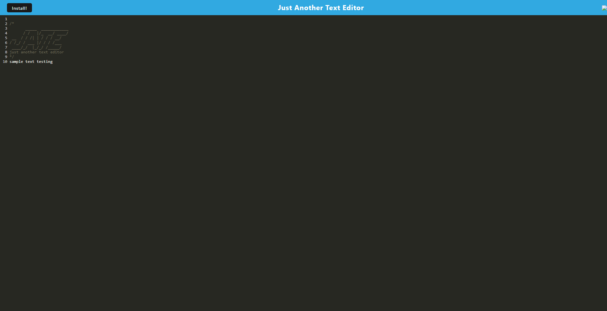

# Text Editor (J.A.T.E)

## Description

The purpose of this project is to learn about PWAs (Progressive Web Applications). The motivation for this project was to demonstrate a comprehensive understanding about how PWAs exemplify application development that bundles code that is faster and intallable to work offline. This project was built to create an application that allows users to install a text editor application with fully functioning capabilties offline locally.

## Installation

Users will note that there is an "install" button on the top left corner of the application that will prompt them whether they would like to install the application locally for offline use.

## Usage

The home page of the application displays a simple text editor template where users may enter text on the screen to use the application. 

## Credits

Webpack for the module bundler program used to bundle Javascript files

## Link(s)

https://github.com/chriswaje/text-editor (Link to GitHub repository)

https://cw-text-editor-4e321809ae9a.herokuapp.com/ (Link to deployed application)

## Image(s)

